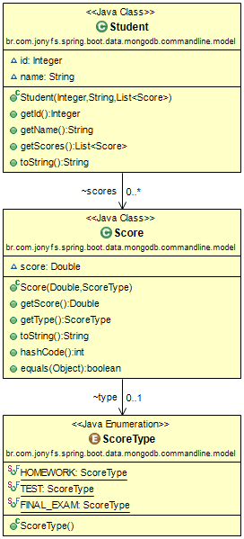

# A Spring Boot Commandline example with Spring Data and MongoDB

### Class Diagram
Imagine a school with students and scores...

This Example will generate 100 students with 3 score types. 

### Tools
[Spring Boot](http://projects.spring.io/spring-boot/)

[Spring Data MongoDB](http://projects.spring.io/spring-data-mongodb)

[MongoDB](https://www.mongodb.com/)

Obs.: to run this example is necessary a MongoDB server running in localhost. See [MongoConfig.java](https://github.com/jonyfs/spring-boot-data-mongodb-commandline/blob/master/src/main/java/br/com/jonyfs/spring/boot/data/mongodb/commandline/config/MongoConfig.java)

### Run it!
mvn package spring-boot:run

